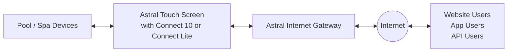

# ConnectMyPool Home Automation API

This document is a structured transcription of the vendor's 23-page
**ConnectMyPool Home Automation Integration Guide**. It preserves the published
API contract while converting prose, pseudo-JSON, and page-spanning tables into
formats that are easier for humans and AI systems to search and reason about.

> [!IMPORTANT]
> The source PDF contains contradictory field names in the Pool Action request.
> These contradictions are documented in
> [Source ambiguities and errata](#source-ambiguities-and-errata). Do not assume
> that a normalized field name in client code is correct without testing it
> against the live API or the vendor test program.

## At a glance

- Protocol: HTTP POST with JSON request and response bodies.
- Authentication: a pool-specific `pool_api_code` in every request body.
- Endpoint paths: `/api/poolconfig`, `/api/poolstatus`, `/api/poolaction`, and
  `/api/poolactionstatus`.
- Base URL: not explicitly stated in the source.
- Headers and HTTP status codes: not specified in the source.
- Reads: pool configuration and current pool status.
- Writes: asynchronous actions that change modes, temperatures, lighting, and
  the active favourite.
- Read throttling: pool configuration and pool status are each documented as
  callable at most once every 60 seconds. See [Throttling](#throttling).

## Endpoint index

| Operation | Method | Path | Purpose |
| --- | --- | --- | --- |
| Pool configuration | `POST` | `/api/poolconfig` | Discover the pool's configured devices and capabilities. |
| Pool status | `POST` | `/api/poolstatus` | Read temperatures, selections, modes, colors, and the active favourite. |
| Pool action | `POST` | `/api/poolaction` | Submit a state-changing command. |
| Pool action status | `POST` | `/api/poolactionstatus` | Check a previously submitted asynchronous command. |

All paths above are relative because the source does not publish an explicit
base URL.

## System requirements

API access requires all of the following:

1. The pool or spa has:
   - an Astral Internet Gateway;
   - an Astral Touch Screen; and
   - either an Astral Connect 10 or Astral Connect Lite.
2. The pool is registered and communicating with the ConnectMyPool website or
   mobile app.
3. Astral Pool has approved the pool for API access.

The vendor states that integration is a technical process intended for
professional system integrators familiar with the target automation system and
general programming.

## Architecture and communication model

The pool equipment communicates with ConnectMyPool on a schedule. It sends
configuration and state data and retrieves queued user actions. Website, mobile
app, and API users all interact with the pool through the internet-hosted
ConnectMyPool system.



This scheduled architecture explains why actions have an execution lifecycle:
submitting an action does not necessarily mean the physical controller has
executed it yet.

## Access and authentication

To request API access:

1. Sign in to ConnectMyPool in a desktop browser, not a tablet or mobile device.
2. Open **Settings**, then **Home Automation**.
3. Enter a reason for the request and select **Request Home Automation Access**.
4. Wait for the approval email from Astral Pool.
5. Return to the **Home Automation** page to retrieve the Pool API Code.

Every documented endpoint receives the Pool API Code in the JSON body:

```json
{
  "pool_api_code": "<POOL_API_CODE>"
}
```

Treat this code as a secret. The source does not describe an HTTP authorization
header, API-key header, token refresh flow, or separate user credential.

## Domain model

### Pool and spa selection

A system may be a stand-alone pool, a stand-alone spa, or a combined pool and
spa. A combined system can expose pool/spa selection. The main API-visible
difference is that separate heater set temperatures can be stored for pool and
spa modes.

### Heaters

A pool can have one or more heaters. A heater can heat and, where supported,
cool toward a configured set temperature. The API reads heater configuration
and status and changes heater mode, set temperature, and system-wide
heat/cool selection.

### Solar systems

A pool can have a solar heater. Solar systems have a set temperature and
support Off, Auto, and On modes. The API reads solar configuration and status
and changes solar mode and set temperature.

### Channels

Channels represent devices such as filter pumps, cleaning systems, fountains,
blowers, jets, and audio systems. A channel action cycles through the modes
supported by that device rather than directly setting a requested mode.

Examples from the source:

- Filter Pump: On -> Auto -> Off
- Fountain: On -> Off

### Valves

Valves support Off, Auto, and On modes. The API reads valve configuration and
status and directly sets a valve's mode.

### Lighting zones

Lighting systems are grouped into zones. Each zone supports Off, Auto, and On
modes. A color-enabled zone also exposes its available colors and can be
switched to a selected color or pattern.

### Favourites

A favourite is a named collection of pool settings applied as one action. For
example, a "Spa at night" favourite could turn on spa jets, a heater, a lighting
zone, and audio.

Favourites may be activated by a schedule. Devices in Auto mode follow the
active favourite's settings. In addition to user-defined favourites, every pool
has **All On**, **All Off**, and, when scheduling is enabled, **All Auto**.
Favourite configuration is performed on the Astral Touch Screen; the API only
lists and activates favourites.

## Shared enumerations

### Temperature scale

| Value | Meaning |
| ---: | --- |
| `0` | Celsius |
| `1` | Fahrenheit |

### Pool/spa selection

| Value | Meaning |
| ---: | --- |
| `0` | Spa |
| `1` | Pool |

Only applicable when `pool_spa_selection_enabled` is `true`.

### Heat/cool selection

| Value | Meaning |
| ---: | --- |
| `0` | Cooling |
| `1` | Heating |

Only applicable when `heat_cool_selection_enabled` is `true`.

### Heater mode

| Value | Meaning |
| ---: | --- |
| `0` | Off |
| `1` | On |

### Solar mode

| Value | Meaning |
| ---: | --- |
| `0` | Off |
| `1` | Auto |
| `2` | On |

### Valve and lighting-zone mode

| Value | Meaning |
| ---: | --- |
| `0` | Off |
| `1` | Auto |
| `2` | On |

### Channel mode

| Value | Meaning |
| ---: | --- |
| `0` | Off |
| `1` | Auto |
| `2` | On |
| `3` | Low Speed |
| `4` | Medium Speed |
| `5` | High Speed |

Available channel modes depend on the device.

### Action execution status

| Value | Meaning | Terminal |
| ---: | --- | --- |
| `0` | Waiting for Execution | No |
| `1` | Executed Successfully | Yes |
| `2` | Execution Failed | Yes |
| `3` | Execution Time Out | Yes |

The Pool Action section defines all four values. The Pool Action Execution
Status section repeats only values `0` through `2`; see
[Source ambiguities and errata](#source-ambiguities-and-errata).

## Pool configuration

Retrieves configured capabilities and devices.

```text
POST /api/poolconfig
```

### Request

```json
{
  "pool_api_code": "<POOL_API_CODE>"
}
```

| Field | Type | Description |
| --- | --- | --- |
| `pool_api_code` | string | Pool-specific API code approved by Astral Pool. |

### Successful response shape

The PDF publishes a type shape, not a concrete example response. The following
TypeScript representation preserves those types while making the nested
structure explicit:

```ts
interface PoolConfigurationResponse {
  pool_spa_selection_enabled: boolean;
  heat_cool_selection_enabled: boolean;
  has_heaters: boolean;
  has_solar_systems: boolean;
  has_channels: boolean;
  has_valves: boolean;
  has_lighting_zones: boolean;
  has_favourites: boolean;
  heaters: Array<{
    heater_number: number;
  }>;
  solar_systems: Array<{
    solar_number: number;
  }>;
  channels: Array<{
    channel_number: number;
    function: number;
    name: string;
  }>;
  valves: Array<{
    valve_number: number;
    function: number;
    name: string;
  }>;
  lighting_zones: Array<{
    lighting_zone_number: number;
    name: string;
    color_enabled: boolean;
    colors_available: Array<{
      color_number: number;
      color_name: string;
    }>;
  }>;
  favourites: Array<{
    favourite_number: number;
    name: string;
  }>;
}
```

### Response fields

| Field | Type | Description |
| --- | --- | --- |
| `pool_spa_selection_enabled` | boolean | Whether a combined system can switch between pool and spa. |
| `heat_cool_selection_enabled` | boolean | Whether the system can switch between heating and cooling. |
| `has_heaters` | boolean | Whether heaters are attached. |
| `has_solar_systems` | boolean | Whether solar heaters are attached. |
| `has_channels` | boolean | Whether channel devices are attached. |
| `has_valves` | boolean | Whether valves are attached. |
| `has_lighting_zones` | boolean | Whether lighting zones are attached. |
| `has_favourites` | boolean | Whether favourites are configured. |
| `heaters` | array | Attached heaters. |
| `heaters[].heater_number` | integer | Heater identifier. |
| `solar_systems` | array | Attached solar heaters. |
| `solar_systems[].solar_number` | integer | Solar-heater identifier. |
| `channels` | array | Attached channel devices. |
| `channels[].channel_number` | integer | Channel identifier. |
| `channels[].function` | integer | Channel-function enumeration. |
| `channels[].name` | string | Descriptive channel name. |
| `valves` | array | Attached valves. |
| `valves[].valve_number` | integer | Valve identifier. |
| `valves[].function` | integer | Valve-function enumeration. |
| `valves[].name` | string | Descriptive valve name. |
| `lighting_zones` | array | Attached lighting zones. |
| `lighting_zones[].lighting_zone_number` | integer | Lighting-zone identifier. |
| `lighting_zones[].name` | string | Descriptive lighting-zone name. |
| `lighting_zones[].color_enabled` | boolean | Whether the zone can change color. |
| `lighting_zones[].colors_available` | array | Colors or patterns supported by this zone. |
| `lighting_zones[].colors_available[].color_number` | integer | Color identifier. |
| `lighting_zones[].colors_available[].color_name` | string | Color or pattern name. |
| `favourites` | array | Configured favourites. |
| `favourites[].favourite_number` | integer | Favourite identifier. |
| `favourites[].name` | string | Descriptive favourite name. |

### Channel function

| Value | Function |
| ---: | --- |
| `1` | Filter Pump |
| `2` | Cleaning Pump |
| `3` | Heater Pump |
| `4` | Booster Pump |
| `5` | Waterfall Pump |
| `6` | Fountain Pump |
| `7` | Spa Pump |
| `8` | Solar Pump |
| `9` | Blower |
| `10` | Swimjet |
| `11` | Jets |
| `12` | Spa Jets |
| `13` | Overflow |
| `14` | Spillway |
| `15` | Audio |
| `16` | Hot Seat |
| `17` | Heater Power |
| `18` | Custom Name |

### Valve function

| Value | Function |
| ---: | --- |
| `1` | Pool/spa |
| `2` | Solar |

### Throttling

The source documents a maximum request frequency of once every 60 seconds for
this endpoint. A request made before the interval expires returns an error. For
five minutes after an action is submitted, the source says that "all API calls"
are not time-throttled.

## Pool status

Retrieves current pool state, including temperatures, selections, device modes,
lighting colors, and the active favourite.

```text
POST /api/poolstatus
```

### Request

```json
{
  "pool_api_code": "<POOL_API_CODE>",
  "temperature_scale": 0
}
```

| Field | Type | Description |
| --- | --- | --- |
| `pool_api_code` | string | Pool-specific API code approved by Astral Pool. |
| `temperature_scale` | integer | `0` for Celsius or `1` for Fahrenheit. |

### Successful response shape

```ts
interface PoolStatusResponse {
  pool_spa_selection: number;
  heat_cool_selection: number;
  temperature: number;
  active_favourite: number;
  heaters: Array<{
    heater_number: number;
    mode: number;
    set_temperature: number;
    spa_set_temperature: number;
  }>;
  solar_systems: Array<{
    solar_number: number;
    mode: number;
    set_temperature: number;
  }>;
  channels: Array<{
    channel_number: number;
    mode: number;
  }>;
  valves: Array<{
    valve_number: number;
    mode: number;
  }>;
  lighting_zones: Array<{
    lighting_zone_number: number;
    mode: number;
    color?: number;
  }>;
}
```

### Response fields

| Field | Type | Description |
| --- | --- | --- |
| `pool_spa_selection` | integer | Current pool/spa selection: `0` Spa, `1` Pool. Only applicable to combined systems. |
| `heat_cool_selection` | integer | Current heat/cool selection: `0` Cooling, `1` Heating. Only applicable when supported. |
| `temperature` | integer | Current water temperature in the requested scale. |
| `active_favourite` | integer | Active `favourite_number`. The source assigns special meaning to `255`; see the errata section. |
| `heaters` | array | Attached heater statuses. |
| `heaters[].heater_number` | integer | Heater identifier. |
| `heaters[].mode` | integer | Heater mode: `0` Off, `1` On. |
| `heaters[].set_temperature` | integer | Pool set temperature. Also used for a stand-alone spa. |
| `heaters[].spa_set_temperature` | integer | Spa set temperature for a combined pool/spa system. |
| `solar_systems` | array | Attached solar-heater statuses. |
| `solar_systems[].solar_number` | integer | Solar-heater identifier. |
| `solar_systems[].mode` | integer | Solar mode: `0` Off, `1` Auto, `2` On. |
| `solar_systems[].set_temperature` | integer | Solar set temperature. |
| `channels` | array | Attached channel statuses. |
| `channels[].channel_number` | integer | Channel identifier. |
| `channels[].mode` | integer | Device-dependent channel mode, values `0` through `5`. |
| `valves` | array | Attached valve statuses. |
| `valves[].valve_number` | integer | Valve identifier. |
| `valves[].mode` | integer | Valve mode: `0` Off, `1` Auto, `2` On. |
| `lighting_zones` | array | Attached lighting-zone statuses. |
| `lighting_zones[].lighting_zone_number` | integer | Lighting-zone identifier. |
| `lighting_zones[].mode` | integer | Lighting mode: `0` Off, `1` Auto, `2` On. |
| `lighting_zones[].color` | integer, optional | Current color number. Omitted for monochrome zones. |

### Throttling

The source documents a maximum request frequency of once every 60 seconds for
this endpoint. A request made before the interval expires returns an error. For
five minutes after an action is submitted, the source says that "all API calls"
are not time-throttled.

## Pool action

Submits an action that changes the pool's state.

```text
POST /api/poolaction
```

### Request contract as published

The PDF's request schema and its field-definition table disagree. This is the
request object exactly as named in the schema, converted only into valid JSON
placeholder values:

```json
{
  "pool_api_code": "<POOL_API_CODE>",
  "action_code": 1,
  "device_number": 1,
  "string": "",
  "temperature_scale": 0,
  "wait_for_execution": false
}
```

However, the definition table calls `action_code` **`action_number`** and calls
`string` **`value`**. The action tables describe a "value" column but do not
resolve the on-wire field name. See
[Source ambiguities and errata](#source-ambiguities-and-errata) before
implementing this request.

### Request semantics

| Concept | Published names | Type | Description |
| --- | --- | --- | --- |
| Pool API code | `pool_api_code` | string | Pool-specific API code. |
| Action selector | `action_code` in schema; `action_number` in definitions | integer | Action to perform; see the action table. |
| Target device | `device_number` | integer | Device identifier required by the selected action. The semantic identifier may be a channel, valve, heater, favourite, solar system, or lighting zone number. |
| Action value | `string` in schema; `value` in definitions | string | Action-specific value, when required. |
| Temperature scale | `temperature_scale` | integer | `0` Celsius or `1` Fahrenheit. Relevant to temperature values. |
| Wait behavior | `wait_for_execution` | boolean | When `true`, wait for completion before responding. When `false`, use the returned `action_number` to poll action status. |

The source describes the action value's type as a string. Therefore, values
shown as numeric enums or temperatures in the action table are semantic values;
their documented JSON representation is a string (for example, `"2"`), subject
to resolving whether the on-wire key is `string` or `value`.

The source lists every field in the "required JSON POST object," even for
actions whose device or value cells are blank. It does not say whether unused
fields may be omitted or what placeholder values they should contain.

### Successful response

```ts
interface PoolActionResponse {
  action_number: number;
  execution_status: number;
}
```

| Field | Type | Description |
| --- | --- | --- |
| `action_number` | integer | Unique identifier for the submitted instruction. Use it with `/api/poolactionstatus` when `wait_for_execution` is `false`. |
| `execution_status` | integer | `0` Waiting, `1` Successful, `2` Failed, or `3` Timed Out. |

### Actions

In the table below, an em dash means the source leaves that cell blank.

| Action | Description | `device_number` semantic value | Action `value` | Notes |
| ---: | --- | --- | --- | --- |
| `1` | Cycle Channel Mode | Valid `channel_number` | — | Cycles through the modes supported by the channel device. |
| `2` | Set Valve Mode | Valid `valve_number` | `0` Off, `1` Auto, `2` On | Directly sets the valve mode. |
| `3` | Set Pool/Spa Selection | — | `0` Spa, `1` Pool | Combined pool/spa systems only. |
| `4` | Set Heater Mode | Valid `heater_number` | `0` Off, `1` On | Directly sets heater mode. |
| `5` | Set Heater Set Temperature | Valid `heater_number` | `10`-`40` °C or `50`-`104` °F | On a combined system, sets the temperature for the currently selected pool/spa mode. |
| `6` | Set Lighting Zone Mode | Valid `lighting_zone_number` | `0` Off, `1` Auto, `2` On | Directly sets lighting-zone mode. |
| `7` | Set Lighting Zone Color | Valid `lighting_zone_number` | Valid lighting `color_number` | Color-enabled zones only. |
| `8` | Set Active Favourite | Valid `favourite_number` | — | Activates the selected favourite. |
| `9` | Set Solar Mode | Valid `solar_number` | `0` Off, `1` Auto, `2` On | Directly sets solar mode. |
| `10` | Set Solar Set Temperature | Valid `solar_number` | `10`-`40` °C or `50`-`104` °F | The source repeats the same ranges used for heater temperature. |
| `11` | Send Lighting Zone Sync | Valid `lighting_zone_number` | — | Re-synchronizes a supported light with its last selected color after a power cycle. |
| `12` | Set Heat/Cool Selection | — | `0` Cooling, `1` Heating | Systems with heat/cool selection only. |

## Pool action execution status

Checks an action submitted with `wait_for_execution` set to `false`.

```text
POST /api/poolactionstatus
```

### Request

```json
{
  "pool_api_code": "<POOL_API_CODE>",
  "action_number": 123
}
```

| Field | Type | Description |
| --- | --- | --- |
| `pool_api_code` | string | Pool-specific API code approved by Astral Pool. |
| `action_number` | integer | Unique action identifier returned by `/api/poolaction`. |

### Successful response

```ts
interface PoolActionStatusResponse {
  execution_status: number;
}
```

| Field | Type | Description |
| --- | --- | --- |
| `execution_status` | integer | Action execution status. The source explicitly lists `0` Waiting, `1` Successful, and `2` Failed in this section; Pool Action additionally defines `3` Timed Out. |

The source does not specify a polling interval, polling timeout, action-history
retention period, or behavior for an unknown or expired `action_number`.

## Error response

Any API failure returns:

```ts
interface ApiErrorResponse {
  failure_code: number;
  failure_description: string;
}
```

Equivalent JSON shape:

```json
{
  "failure_code": 6,
  "failure_description": "Time Throttle Exceeded"
}
```

The example description above is illustrative; the source defines the field but
does not publish exact response strings for each code.

### Failure codes

| Code | Meaning |
| ---: | --- |
| `1` | General Error |
| `2` | Invalid Pool System |
| `3` | Invalid API Code |
| `4` | API Not Enabled |
| `5` | Invalid API Key |
| `6` | Time Throttle Exceeded |
| `7` | Pool Not Connected |
| `8` | Invalid Action Code |
| `9` | Invalid Value |
| `10` | Invalid Channel Number |
| `11` | Invalid Valve Number |
| `12` | Pool Spa Selection Not Enabled |
| `13` | Invalid Heater |
| `14` | Invalid Heater Set Temp |
| `15` | Invalid Lighting Zone |
| `16` | Lighting Zone Not Color Enabled |
| `17` | Invalid Lighting Zone Color |
| `18` | Invalid Favourite Number |
| `19` | Invalid Solar System Number |
| `20` | Invalid Solar Set Temp |
| `21` | Lighting Zone Does Not Support Sync |
| `22` | Heat Cool Selection Not Supported |

Although failure code `5` is "Invalid API Key," the source does not document an
API-key request field or header separate from `pool_api_code`.

## Lighting zone colors

Only a subset of these values is available for any particular lighting system.
Use `lighting_zones[].colors_available` from the pool-configuration response as
the authoritative per-zone list.

| `color_number` | Name |
| ---: | --- |
| `1` | Red |
| `2` | Orange |
| `3` | Yellow |
| `4` | Green |
| `5` | Blue |
| `6` | Purple |
| `7` | White |
| `8` | User 1 |
| `9` | User 2 |
| `10` | Disco |
| `11` | Smooth |
| `12` | Fade |
| `13` | Magenta |
| `14` | Cyan |
| `15` | Pattern |
| `16` | Rainbow |
| `17` | Ocean |
| `18` | Voodoo Lounge |
| `19` | Deep Blue Sea |
| `20` | Royal Blue |
| `21` | Afternoon Skies |
| `22` | Aqua Green |
| `23` | Emerald |
| `24` | Warm Red |
| `25` | Flamingo |
| `26` | Vivid Violet |
| `27` | Sangria |
| `28` | Twilight |
| `29` | Tranquillity |
| `30` | Gemstone |
| `31` | USA |
| `32` | Mardi Gras |
| `33` | Cool Cabaret |
| `34` | Sam |
| `35` | Party |
| `36` | Romance |
| `37` | Caribbean |
| `38` | American |
| `39` | California Sunset |
| `40` | Royal |
| `41` | Hold |
| `42` | Recall |
| `43` | Peruvian Paradise |
| `44` | Super Nova |
| `45` | Northern Lights |
| `46` | Tidal Wave |
| `47` | Patriot Dream |
| `48` | Desert Skies |
| `49` | Nova |
| `50` | Pink |

## Recommended integration flow

This flow is derived from the published endpoint roles and asynchronous
communication model:

1. Obtain and securely store the Pool API Code.
2. Call `/api/poolconfig` to discover capabilities, identifiers, device
   functions, configured favourites, and per-zone colors.
3. Cache configuration for at least the documented 60-second throttle window.
4. Call `/api/poolstatus` with the desired temperature scale.
5. Validate an intended action against the discovered capabilities and device
   identifiers.
6. Submit `/api/poolaction`.
7. If `wait_for_execution` is `false`, retain the returned `action_number` and
   query `/api/poolactionstatus` until a terminal execution status is returned.
8. Refresh status after execution to confirm physical state.

The source does not define retry, backoff, idempotency, or duplicate-command
semantics. Avoid automatically retrying state-changing actions unless the
outcome is known.

## Source ambiguities and errata

These issues are present in the vendor PDF, not introduced by this conversion:

1. **Pool Action selector name:** the request object uses `action_code`, while
   its definition table calls the request field `action_number`. The overview
   also says "Action Code." The response unambiguously uses `action_number` as
   the submitted instruction's unique identifier.
2. **Pool Action value name:** the request object literally uses
   `string: string`, while the definition and action tables call the field
   `value`. The source does not resolve the on-wire name.
3. **Required-but-unused action fields:** every Pool Action field appears in the
   required object, but multiple actions have blank device or value cells. The
   source does not state whether unused fields are omitted, empty, or populated
   with a sentinel.
4. **Action status value `3`:** Pool Action defines `3` as Execution Time Out.
   Pool Action Execution Status repeats only `0`, `1`, and `2`.
5. **`active_favourite = 255`:** the source says, "a value of 255 indicates on
   active favourite." This appears to be a typo, plausibly meaning "no active
   favourite," but that interpretation is not confirmed by the source.
6. **Solar temperature wording:** the action-value table describes action `10`
   as accepting a "Valid heater set temp," although the action is Set Solar Set
   Temperature. The published ranges are `10`-`40` °C and `50`-`104` °F.
7. **Base URL:** only relative `/api/...` paths are published.
8. **Transport details:** the source does not specify HTTP headers, HTTP status
   codes, timeouts, TLS requirements, or an API version.
9. **Failure code `5`:** "Invalid API Key" exists, but no separate API-key field
   or header is documented.
10. **Typos normalized for readability:** obvious prose and formatting errors
    were corrected without changing contract meaning, including "Chanel" to
    "Channel" and broken identifier spacing such as `heater_ number` to
    `heater_number`.

## Vendor test program

After approval, a test program is available from the ConnectMyPool **Home
Automation** page. It accepts a Pool API Code, can load pool configuration and
status, can send actions, and has a Log tab that shows connection details,
responses, and headers. The vendor recommends it for testing and
troubleshooting an integration.

## Source

- [ConnectMyPool Home Automation Integration Guide (PDF)](https://www.connectmypool.com.au/downloads/Home_Automation_Integration_Guide.pdf)
- Retrieved: 2026-07-25
- PDF length: 23 pages
- The source does not show a publication date, document version, or API version.
